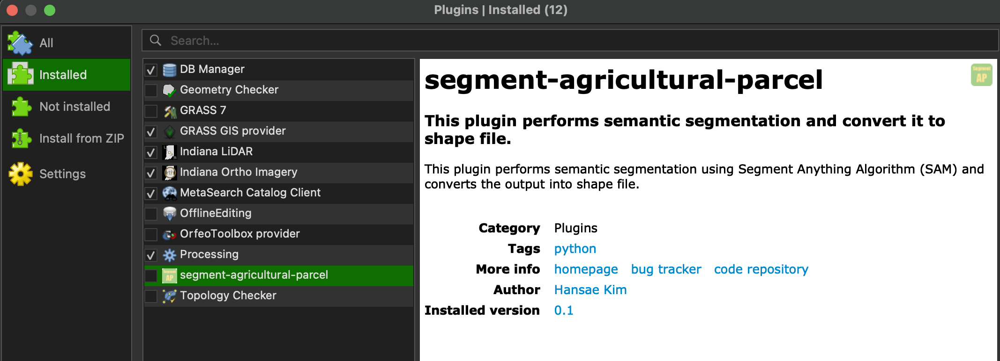
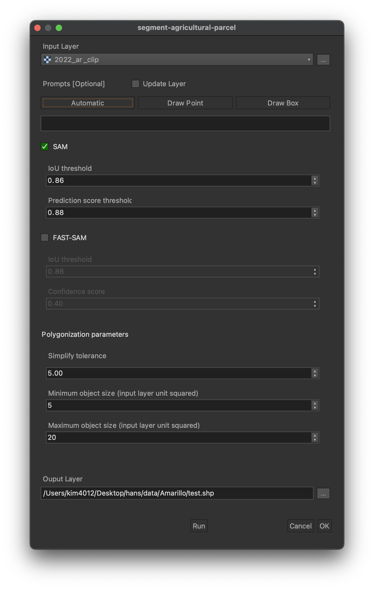

# Installation


## Locate Plugin Folder

### Windows
```%APPDATA%\QGIS\QGIS3\profiles\default\python\plugins```
### Mac
```~/Library/Application\ Support/QGIS/QGIS3/profiles/default/python/plugins```
### Linux
```~/.local/share/QGIS/QGIS3/profiles/default/python/plugins```


## Clone the Repository

Segment Anything Model (SAM)
```bash
git clone git@github.com:breadnbutter0/segment-agricultural-parcel.git
```

(Optional) Fast SAM
```bash
git clone https://github.com/CASIA-IVA-Lab/FastSAM.git
```


## Download the Checkpoint File
Download SAM checkpoint file
```bash
mkdir checkpoint & cd checkpoint
```

```windows```
```bash
wget https://dl.fbaipublicfiles.com/segment_anything/sam_vit_h_4b8939.pth -o sam_vit_h_4b8939.pth
```

```linux or mac```
```bash
wget https://dl.fbaipublicfiles.com/segment_anything/sam_vit_h_4b8939.pth
```

(Optional) Download fast sam checkpoint file

```bash
gdown https://drive.google.com/u/0/uc?id=1m1sjY4ihXBU1fZXdQ-Xdj-mDltW-2Rqv
```


## For Linux/MacOS Users
Open the terminal and run following script

### Linux
```bash
cd /usr/bin
```

###  Mac
```bash
cd /Applications/QGIS.app/Contents/MacOS/bin
```

### Install Library Dependencies
SAM dependencies
```bash
./pip3 install segment-anything torch torchvision opencv-python==3.4.18.65
```
(Optional) Fast SAM dependencies
```bash
./pip3 install -r {plugin_directory}/FastSAM/requirements.txt 
```
```bash
./pip3 install git+https://github.com/openai/CLIP.git
```


## For Windows Users

### Open OsGeo4W Shell
OsGeo4W Sheel can be found on ```Start -> All Programs -> OSGeo4W ```

### Install Library Dependencies
SAM dependencies
```PowerShell
pip3 install segment-anything torch torchvision opencv-python==3.4.18.65
```

(Optional) Fast SAM dependencies
```bash
pip3 install -r {plugin_directory}/FastSAM/requirements.txt 
```
```bash
pip3 install git+https://github.com/openai/CLIP.git
```


## Activate Segment-Agricultural-Parcel Plugin

``` Plugins -> Manage and Install Plugins.. -> Check 'segment-agricultural-parcel' checkbox ```





# How to Run

<p align="center">
    
</p>

## Automatic Mask Generator
1. Select input layer.
2. Click ```Automatic``` box.
3. Check the segmentation model ```SAM``` or ```Fast SAM``` (if available).
4. Set model parameters.
    - ```IoU threshold```: Lower value tends to give larger masks.
    - ```Prediction score threshold```: Higher value gives more strict results.
    - ```Confidence score```: Similar to prediction score.
    - ```Simplify tolerance```: Higher value give more simplified boundaries (rectangular shape) with fewer vetexes.
    - ```Minimum and maximum object size```: The range of the output polygons' area should lie in. The unit is an area which follows the input layer's unit.
6. Enter the output file name and directory.


## Segmentation Using Prompts
1. Check ```Update Layer``` to update the existing polygons.
2. Choose either ```Draw Point``` or ```Draw Box```
3. Pick a point or draw a box on canvas.
4. Choose your model.
5. Set model parameters.
    - It is generally a good idea to lower your threshold if you failed to detect desired objects in automatic mode.
6. Set polygonization parameters.
7. Enter the output file name and directory.


# Issues
- FastSAM is only supported by Windows and MacOS.
- Apple's Metal Performance Shaders (mps) is not supported by SAM.
- CUDA and CPU are suppported.
